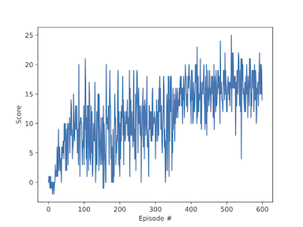

# Navigation with DQN
Udacity Reinforcement Learning Nanodegree Project 1
## Overview

In this project an agent is trained to navigate in a square world and collect yellow bananas. 
The agent receives a reward of +1 for collecting a yellow banana, and a reward of -1 for collecting a blue banana. 
The goal of the agent is to collect as many yellow bananas as possible while avoiding blue bananas.

The state space has 37 dimensions and contains the agent's velocity, along with ray-based perception of objects around agent's forward direction. Given this information, the agent has to learn how to best select actions. Four discrete actions are available, corresponding to:

- 0 - move forward.
- 1 - move backward.
- 2 - turn left.
- 3 - turn right.

The given episodic task is considered as solved when the trained agent is able to obtain an average reward of +13 over 100 consecutive episodes.

### Mothodology

##### 1. Learning algorithm.
The code included in this repository implements a Deep Q-Network (DQN) that is trained on episodes collected from the Unity Banan Collector environment to approximate the Q-value function.
More specifically, a Deep Q-Learning algorithm presented by Mnih et al., 2015 and 
enhanced using the following two strategies was used:
 - Prioretized Experiance Replay strategy (Schaul et al., 2015), and
 - Dueling Networks (Wang et al., 2015).
 
The code also includes an implementation of the Double DQN (Van Hasselt et al., 2016) strategy, however, applying it did not result in notable performance gain.   

##### 2. Architecture.

A fully connected network, that features the following architecture is used;

| Layer         | (in, out)     | Acivation function |
| ------------- | ------------- |-------------       |
| Layer 1       | (state size,128)  | Relu|
| Layer 2 | (128,64)  |Relu  |
| Layer 3  | (64,32) |Relu  |
| State Value  | (32,1)  | -  |
| Advantage  | (32, action_size)  | -  |

here, State Value and Advantage layers 

##### 3. Results.

In the training the agent is able to obtain an average score of +16 (over 100 consecutive episodes) after 600 episodes.
```
Episode 100 Average Score: 5.715
Episode 200	Average Score: 7.92
Episode 300	Average Score: 10.19
Episode 400	Average Score: 12.54
Episode 500	Average Score: 15.47
Episode 600	Average Score: 16.32
```

The following graph shows the dynamics of the average reward over 100 consecutive episodes, where the x-axis corresponds to the episode number and the y-axis to the score.


Visualization of the agent's behaviour:


## Getting Started

#### Prerequisites
Follow the instructions in the [DRLND GitHub](https://github.com/udacity/deep-reinforcement-learning#dependencies) repository to set up the Python environment. 
By following these instructions, you will install PyTorch, the ML-Agents toolkit, and a few more Python packages required to complete the project.

Clone this repository in the "p1_navigation" folder of the DRLND GitHub repository.

Download the Unity environment from one of the links below. You need only select the environment that matches your operating system:

- Linux: [click here](https://s3-us-west-1.amazonaws.com/udacity-drlnd/P1/Banana/Banana_Linux.zip)
- Mac OSX: [click here](https://s3-us-west-1.amazonaws.com/udacity-drlnd/P1/Banana/Banana.app.zip)
- Windows (32-bit): [click here](https://s3-us-west-1.amazonaws.com/udacity-drlnd/P1/Banana/Banana_Windows_x86.zip)
- Windows (64-bit): [click here](https://s3-us-west-1.amazonaws.com/udacity-drlnd/P1/Banana/Banana_Windows_x86_64.zip)
https://support.microsoft.com/en-us/help/827218/how-to-determine-whether-a-computer-is-running-a-32-bit-version-or-64
(For Windows users) Check out this [link](https://support.microsoft.com/en-us/help/827218/how-to-determine-whether-a-computer-is-running-a-32-bit-version-or-64) if you need help with determining if your computer is running a 32-bit version or 64-bit version of the Windows operating system.

(For AWS) If you'd like to train the agent on AWS (and have not enabled a virtual screen), download the "headless" version of the environment following this [link](https://s3-us-west-1.amazonaws.com/udacity-drlnd/P1/Banana/Banana_Linux_NoVis.zip).

#### Hyperparameters

Main hyperparameters of the learning algorithm can be found in *agent.py*, these were tuned to perform well on the given environment and include:

- BUFFER_SIZE - the size of the replay buffer of a DQN
- BATCH_SIZE - minibatch size - number of samples selected from the replay buffer based on experience score
- GAMMA - discount factor
- LR - learning rate
- UPDATE_EVERY - how often to update the target network


#### Instructions
In order to train a new agent, run:
```
python train.py 
    --total_episodes ="Number of episodes to learn from" 
    --env = "Path to the downloaded Unity environment"
    --ddqn = "Whether to use the Double DQN strategy"
```
To test a trained model, run:
```
python test.py 
    --env = "Path to the downloaded Unity environment"
    --model_pth = "Path to the trained model"
```

PATH_TO_THE_DOWNLOADED_UNITY_ENVIRONMENT: 
- Mac: "path/to/Banana.app"
- Windows (x86): "path/to/Banana_Windows_x86/Banana.exe"
- Windows (x86_64): "path/to/Banana_Windows_x86_64/Banana.exe"
- Linux (x86): "path/to/Banana_Linux/Banana.x86"
- Linux (x86_64): "path/to/Banana_Linux/Banana.x86_64"
- Linux (x86, headless): "path/to/Banana_Linux_NoVis/Banana.x86"
- Linux (x86_64, headless): "path/to/Banana_Linux_NoVis/Banana.x86_64"

## Future Work

- Building a CNN to learn from visual frames directly.
- Adding complexity to the environment - e.g. walls and corridors.
- Further hyperparameter tuning could improve the learning speed.
- Improving the reward strategy, e.g. increasingly higher negative reward for eating a blue banana.

## Sources

Schaul, T., Quan, J., Antonoglou, I., & Silver, D. (2015). Prioritized experience replay. arXiv preprint arXiv:1511.05952.

Mnih, V., Kavukcuoglu, K., Silver, D., Rusu, A. A., Veness, J., Bellemare, M. G., ... & Petersen, S. (2015). Human-level control through deep reinforcement learning. Nature, 518(7540), 529.

Wang, Z., Schaul, T., Hessel, M., Van Hasselt, H., Lanctot, M., & De Freitas, N. (2015). Dueling network architectures for deep reinforcement learning. arXiv preprint arXiv:1511.06581.

Van Hasselt, H., Guez, A., & Silver, D. (2016, February). Deep Reinforcement Learning with Double Q-Learning. In AAAI (Vol. 2, p. 5).