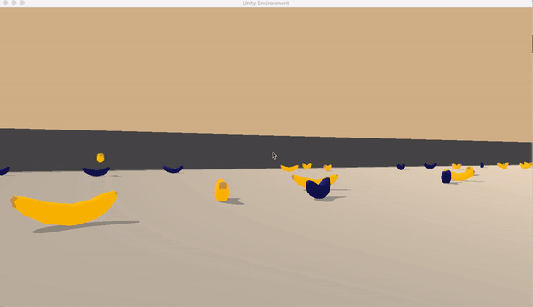

# Navigation with DQN
Udacity Reinforcement Learning Nanodegree Project 1
## Overview

In this project an agent is trained to navigate in a square world and collect yellow bananas. 
The agent receives a reward of +1 for collecting a yellow banana, and a reward of -1 for collecting a blue banana. 
The goal of the agent is to collect as many yellow bananas as possible while avoiding blue bananas.

The state space has 37 dimensions and contains the agent's velocity, along with ray-based perception of objects around agent's forward direction. Given this information, the agent has to learn how to best select actions. Four discrete actions are available, corresponding to:

- 0 - move forward.
- 1 - move backward.
- 2 - turn left.
- 3 - turn right.

The given episodic task is considered as solved when the trained agent is able to obtain an average reward of +13 over 100 consecutive episodes.

### Mothodology

##### 1. Learning algorithm.
The code included in this repository implements a Deep Q-Network (DQN) that is trained on episodes collected from the Unity Banan Collector environment to approximate the Q-value function.
More specifically, a Deep Q-Learning algorithm presented by Mnih et al., 2015 and 
enhanced using the following two strategies was used:
 - Prioretized Experiance Replay strategy (Schaul et al., 2015), and
 - Dueling Networks (Wang et al., 2015).
 
The code also includes an implementation of the Double DQN strategy, however, it did not show high performance advantage.

##### 2. Architecture.

A fully connected network, that features the following architecture is used;

| Layer         | (in, out)     | Acivation function |
| ------------- | ------------- |-------------       |
| Layer 1       | (state size,128)  | Relu|
| Layer 2 | (128,64)  |Relu  |
| Layer 3  | (64,32) |Relu  |
| State Value  | (32,1)  | -  |
| Advantage  | (32, action_size)  | -  |

here, State Value and Advantage layers 

##### 3. Results.

In the training the agent is able to obtain an average score of +16 ()over 100 consecutive episodes) after 600 episodes.
```
Episode 100 Average Score: 5.715
Episode 200	Average Score: 7.92
Episode 300	Average Score: 10.19
Episode 400	Average Score: 12.54
Episode 500	Average Score: 15.47
Episode 600	Average Score: 16.32
```


The trained model performs like this:




## Getting Started

#### Prerequisites
Download the environment from one of the links below. You need only select the environment that matches your operating system:

- Linux: click here
- Mac OSX: click here
- Windows (32-bit): click here
- Windows (64-bit): click here

(For Windows users) Check out this link if you need help with determining if your computer is running a 32-bit version or 64-bit version of the Windows operating system.

(For AWS) If you'd like to train the agent on AWS (and have not enabled a virtual screen), then please use this link to obtain the environment.

Place the file in the DRLND GitHub repository, in the p1_navigation/ folder, and unzip (or decompress) the file.

#### Instructions
In order to train a new aagent, run:
```
python train.py
```
To test a trained model, run:
```
python test.py
```


## Future Work


## Sources

Schaul, T., Quan, J., Antonoglou, I., & Silver, D. (2015). Prioritized experience replay. arXiv preprint arXiv:1511.05952.

Mnih, V., Kavukcuoglu, K., Silver, D., Rusu, A. A., Veness, J., Bellemare, M. G., ... & Petersen, S. (2015). Human-level control through deep reinforcement learning. Nature, 518(7540), 529.

Wang, Z., Schaul, T., Hessel, M., Van Hasselt, H., Lanctot, M., & De Freitas, N. (2015). Dueling network architectures for deep reinforcement learning. arXiv preprint arXiv:1511.06581.