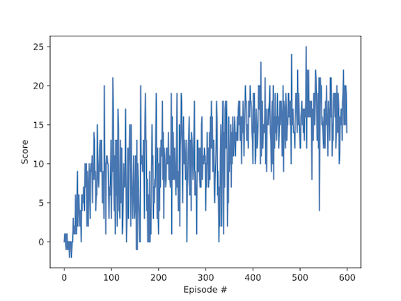

## Overview

In this project an agent is trained to navigate in a square world and collect yellow bananas. 
The agent receives a reward of +1 for collecting a yellow banana, and a reward of -1 for collecting a blue banana. 
The goal of the agent is to collect as many yellow bananas as possible while avoiding blue bananas.

The state space has 37 dimensions and contains the agent's velocity, along with ray-based perception of objects around agent's forward direction. Given this information, the agent has to learn how to best select actions. Four discrete actions are available, corresponding to:

- 0 - move forward.
- 1 - move backward.
- 2 - turn left.
- 3 - turn right.

The given episodic task is considered as solved when the trained agent is able to obtain an average reward of +13 over 100 consecutive episodes.

##### Learning algorithm.
The code included in this repository implements a Deep Q-Network (DQN) that is trained on episodes collected from the Unity Banan Collector environment to approximate the Q-value function.
More specifically, a Deep Q-Learning algorithm presented by Mnih et al., 2015 and 
enhanced using the following two strategies was used:
 - Prioretized Experiance Replay strategy (Schaul et al., 2015), and
 - Dueling Networks (Wang et al., 2015).
 
The code also includes an implementation of the Double DQN (Van Hasselt et al., 2016) strategy, however, applying it did not result in any notable performance gain.   

##### Architecture.

A fully connected network, that features the following architecture is used:

| Layer         | (in, out)     | Acivation function |
| ------------- | ------------- |-------------       |
| Layer 1       | (state size,128)  | Relu|
| Layer 2 | (128,64)  |Relu  |
| Layer 3  | (64,32) |Relu  |
| State Value  | (32,1)  | -  |
| Advantage  | (32, action_size)  | -  |

#### Hyperparameters

Main hyperparameters of the learning algorithm can be found in *agent.py*, these were tuned to perform well on the given environment and include:

- BUFFER_SIZE = int(1e5)  - the size of the replay buffer of a DQN
- BATCH_SIZE =128 - minibatch size - number of samples selected from the replay buffer based on experience score
- GAMMA = 0.99 - discount factor
- LR = 4e-5 - learning rate
- UPDATE_EVERY = 2 - how often to update the target network
- BETA_START = 0.2 - exponent of the bias correction term caused by prioritized experience replay
- PROB_ALPHA 0.8 - the threshold of using experience replay priorities or randomness

#### Results

In the training the agent is able to obtain an average score of +16 (over 100 consecutive episodes) after 600 episodes.
```
Episode 100 Average Score: 5.715
Episode 200	Average Score: 7.92
Episode 300	Average Score: 10.19
Episode 400	Average Score: 12.54
Episode 500	Average Score: 15.47
Episode 600	Average Score: 16.32
```

The following graph shows the dynamics of the average reward over 100 consecutive episodes, where the x-axis corresponds to the episode number and the y-axis to the score.


## Future Work

- Building a CNN to learn from visual frames directly.
- Adding complexity to the environment - e.g. walls and corridors.
- Further hyperparameter tuning could improve the learning speed.
- Improving the reward strategy, e.g. increasingly higher negative reward for eating a blue banana.

## Sources

Schaul, T., Quan, J., Antonoglou, I., & Silver, D. (2015). Prioritized experience replay. arXiv preprint arXiv:1511.05952.

Mnih, V., Kavukcuoglu, K., Silver, D., Rusu, A. A., Veness, J., Bellemare, M. G., ... & Petersen, S. (2015). Human-level control through deep reinforcement learning. Nature, 518(7540), 529.

Wang, Z., Schaul, T., Hessel, M., Van Hasselt, H., Lanctot, M., & De Freitas, N. (2015). Dueling network architectures for deep reinforcement learning. arXiv preprint arXiv:1511.06581.

Van Hasselt, H., Guez, A., & Silver, D. (2016, February). Deep Reinforcement Learning with Double Q-Learning. In AAAI (Vol. 2, p. 5).
